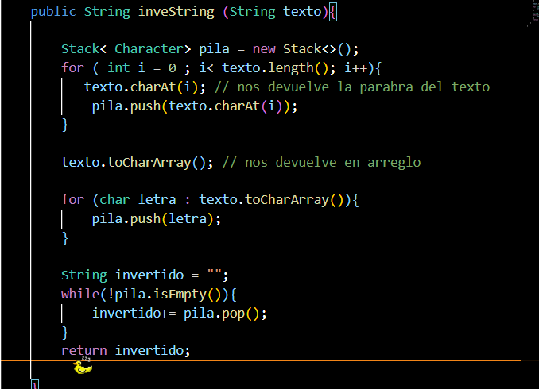

# Práctica:  Estructuras Dinamicas lineales 

## Datos del Estudiante
- **Nombre:** Miguel Maza
- **Curso:** Computacion grupo 1
- **Fecha:** 8/6/2026

---
## 1. Implementación de estructuras dinamicas lineales 

**Fecha:** 8/6/2026

**Descripción:** Se implemento los diferentes tipos de listas , su funcionalidad y como se comportan al eliminar elementos de sus listas, ademas del funcionaiento de los diferentes comandos 

- Listas enlazadas con LinkedList
- Pilas con Stack y Deque 
- Colas con Queue

Ejercicio 1 

